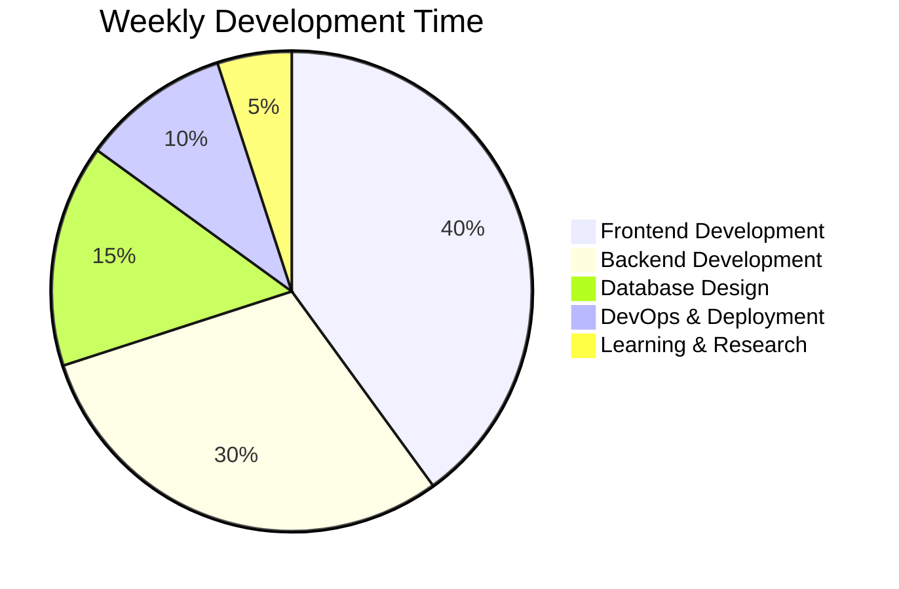

# 🎨 README Customization Guide

## 🚀 Quick Start

1. **Replace Placeholders**: Update all `YOUR_USERNAME` instances with your actual GitHub username
2. **Personalize Content**: Customize the about me section, skills, and projects
3. **Add Your Links**: Update social media links and portfolio URLs
4. **Choose Your Colors**: Modify the color scheme to match your preferences

## 📝 Content Customization

### Personal Information
```markdown
# 👋 Hi there, I'm [Your Actual Name]!
```
Replace `[Your Name]` with your real name.

### About Me Section
Customize the description to match your background and interests:
```markdown
I'm a passionate **Full Stack Web Developer** who loves creating beautiful, functional, and user-friendly web applications. I enjoy turning complex problems into simple, beautiful, and intuitive solutions.
```

### Skills & Technologies
Remove badges for technologies you don't use and add new ones:

**To add a new badge:**
```markdown

```

**Popular badge colors:**
- Blue: `007ACC`
- Green: `4CAF50`
- Red: `F44336`
- Purple: `9C27B0`
- Orange: `FF9800`

### Projects Section
Replace the example projects with your actual projects:

```markdown
## 🚀 Featured Projects

<div align="center">
  <table>
    <tr>
      <td width="50%">
        <h3 align="center">🎯 [Your Project Name]</h3>
        <div align="center">
          <a href="https://github.com/YOUR_USERNAME/project-repo" target="_blank">
            
          </a>
        </div>
        <p align="center">
          <a href="https://github.com/YOUR_USERNAME/project-repo" target="_blank">
            
          </a>
          <a href="https://your-project-demo.com" target="_blank">
            
          </a>
        </p>
      </td>
    </tr>
  </table>
</div>
```

## 🎨 Visual Customization

### Color Scheme
The current theme uses a dark blue color scheme (`#00D4FF`). You can change this by updating all color references:

**Popular color schemes:**
- **Purple**: `#8B5CF6`
- **Green**: `#10B981`
- **Pink**: `#EC4899`
- **Orange**: `#F59E0B`
- **Red**: `#EF4444`

### Typing Animation
Customize the typing animation text:

```markdown

```

**Parameters you can customize:**
- `font`: Font family (Fira+Code, Roboto, etc.)
- `weight`: Font weight (300, 400, 500, 600, 700)
- `size`: Font size (16, 20, 24, 28, 32)
- `pause`: Pause between lines in milliseconds
- `color`: Text color (hex code without #)
- `lines`: Your custom text lines (separated by semicolons)

### GitHub Stats Theme
Change the stats theme by modifying the `theme` parameter:

**Available themes:**
- `radical` (current)
- `dark`
- `tokyonight`
- `dracula`
- `cobalt`
- `synthwave`
- `highcontrast`
- `github_dark`

## 🔗 Social Links

Update all social media links with your actual profiles:

```markdown
## 📫 Connect With Me

<div align="center">
  <a href="https://linkedin.com/in/YOUR_ACTUAL_USERNAME" target="_blank">
    
  </a>
  <a href="https://twitter.com/YOUR_ACTUAL_USERNAME" target="_blank">
    
  </a>
  <!-- Add more social links as needed -->
</div>
```

## 📊 Stats Customization

### GitHub Stats
Customize your GitHub stats card:

```markdown

```

**Additional parameters:**
- `hide`: Hide specific stats (contribs, issues, stars, commits, prs, reviews)
- `count_private`: Show private contributions (true/false)
- `include_all_commits`: Include all commits in stats (true/false)

### Streak Stats
Customize your streak card:

```markdown

```

## 🏆 Trophies

Customize the trophies section:

```markdown

```

**Available trophies:**
- `stars` - Total stars earned
- `commits` - Total commits
- `pr` - Pull requests
- `issues` - Issues opened
- `followers` - Followers gained
- `repositories` - Repositories created
- `all` - All trophies

## 📈 Mermaid Charts

Customize the development breakdown chart:



## 🎯 Fun Facts

Update the fun facts with your personal information:

```markdown

```

## 🔧 Advanced Customization

### Custom CSS (if supported)
Some platforms support custom CSS. You can add:

```html
<style>
  .profile-readme {
    background: linear-gradient(45deg, #667eea 0%, #764ba2 100%);
    border-radius: 10px;
    padding: 20px;
  }
</style>
```

### Custom Badges
Create custom badges using shields.io:

```markdown

```

### Profile Views Counter
The profile views counter uses:

```markdown

```

## 📱 Mobile Optimization

The README is already mobile-responsive, but you can optimize further by:

1. **Shorter lines**: Keep text lines under 80 characters
2. **Compact tables**: Use smaller table layouts for mobile
3. **Responsive images**: All images are already responsive

## 🚀 Deployment Tips

1. **Test locally**: Use a markdown previewer to test your README
2. **Check links**: Ensure all links work correctly
3. **Optimize images**: Keep image sizes reasonable
4. **Update regularly**: Keep your README current with your latest projects

## 🎨 Theme Presets

Here are some popular color combinations you can use:

### Ocean Blue (Current)
- Primary: `#00D4FF`
- Background: `#0D1117`
- Text: `#FFFFFF`

### Forest Green
- Primary: `#10B981`
- Background: `#0F172A`
- Text: `#F8FAFC`

### Sunset Orange
- Primary: `#F59E0B`
- Background: `#1F2937`
- Text: `#F9FAFB`

### Royal Purple
- Primary: `#8B5CF6`
- Background: `#1E1B4B`
- Text: `#F3F4F6`

### Rose Pink
- Primary: `#EC4899`
- Background: `#831843`
- Text: `#FDF2F8`

Remember to update all color references consistently throughout your README for a cohesive look! 