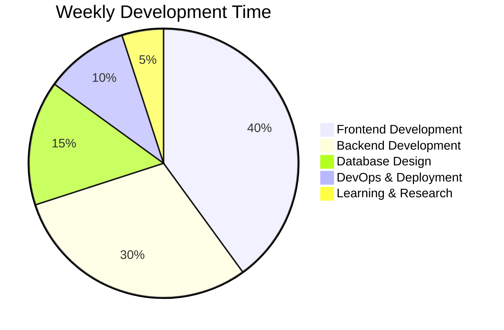

# 👋 Hi there, I'm Hrieshikesh!

  

## 🚀 About Me

I'm a passionate **Full Stack Web Developer** who loves creating beautiful, functional, and user-friendly web applications. I enjoy turning complex problems into simple, beautiful, and intuitive solutions.

### 🎯 What I Do
- 💻 **Frontend Development** - Creating responsive and interactive user interfaces
- 🔧 **Backend Development** - Building robust APIs and server-side logic
- 🗄️ **Database Design** - Designing efficient database schemas
- 🚀 **DevOps** - Deploying and maintaining applications
- 📱 **Mobile Development** - Building cross-platform mobile applications

---

## 🛠️ Tech Stack & Languages

### Frontend Technologies

### Backend Technologies

### Databases

### Cloud & DevOps

### Mobile Development

### Tools & IDEs

---

## 📊 GitHub Stats & Activity

  
  
  

## 🐍 Contribution Snake

  

## 📈 Top Languages

  

---

## 🏆 GitHub Trophies

  

---

## 🚀 Featured Projects

  <table>
    <tr>
      <td width="50%">
        <h3 align="center">🎯 Project 1</h3>
        

          
        

        

          
          
        

      </td>
      <td width="50%">
        <h3 align="center">🚀 Project 2</h3>
        

          
        

        

          
          
        

      </td>
    </tr>
  </table>

---

## 🌟 Skills & Expertise

### Frontend Development
- **Responsive Design** - Mobile-first approach with CSS Grid and Flexbox
- **Modern JavaScript** - ES6+, Async/Await, Promises, Modules
- **React Ecosystem** - Hooks, Context API, Redux, React Router
- **CSS Frameworks** - Tailwind CSS, Bootstrap, Material-UI
- **Build Tools** - Webpack, Vite, Babel, ESLint

### Backend Development
- **RESTful APIs** - Design and implementation of scalable APIs
- **Authentication** - JWT, OAuth, Session management
- **Database Design** - Relational and NoSQL database optimization
- **Microservices** - Service-oriented architecture
- **API Documentation** - Swagger/OpenAPI, Postman collections

### DevOps & Deployment
- **CI/CD Pipelines** - GitHub Actions, Jenkins, GitLab CI
- **Containerization** - Docker, Docker Compose
- **Cloud Platforms** - AWS, Google Cloud, Azure
- **Monitoring** - Application performance monitoring
- **Security** - HTTPS, CORS, Input validation

---

## 📫 Connect With Me

  
  
  
  
  
  

---

## 🎯 Current Focus

  

---

## 📊 Weekly Development Breakdown

---

## 🏅 Certifications & Achievements

  
  
  
  

---

## 🎉 Fun Facts

  

---

  
  
  
⭐ Star this repository if you found it helpful!

  
  

 
